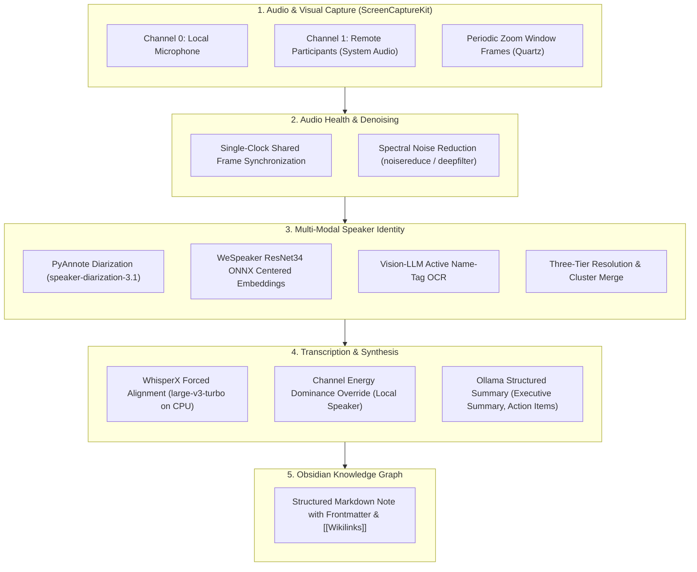

# EchoID — Local, Identity-Aware Meeting Notes

[](https://www.gnu.org/licenses/gpl-3.0)
[](https://github.com/akt1215/EchoID/actions/workflows/ci.yml)
[](https://www.apple.com/macos/)
[](https://www.python.org/)
[](https://github.com/akt1215/EchoID)
[](https://akt1215.github.io/projects/echoid/)

Local-first macOS application that records Zoom meetings, transcribes and diarizes them, resolves speaker identities via voice biometrics and visual name tags, runs local LLM summarization, and exports structured notes directly into an Obsidian vault.

Its default configuration keeps all meeting audio, transcripts, and speaker profiles strictly on the local machine. Optional cloud backends can be enabled when their speed or accuracy is worth sending audio or frames to a provider.

## Table of Contents

- [Key Features](#key-features)
- [Architecture & Pipeline](#architecture--pipeline)
- [File Map](#file-map)
- [Setup & Prerequisites](#setup)
- [Quick Start](#quick-start)
- [Audio Setup (macOS 15+)](#audio-setup-one-time)
- [Usage Workflows](#usage)
- [Sample Obsidian Note](#sample-obsidian-output)
- [Audio Layouts: Dual-Channel vs. Mixed Ingest](#two-audio-layouts-recordings-this-tool-made-vs-everything-else)
- [Known Issues & Workarounds](#known-issues--workarounds)
- [Roadmap & Possible Improvements](#possible-improvements)
- [License](#license)

## Key Features

- **Drift-Free Single-Clock Capture**: On macOS 15+, ScreenCaptureKit captures both local microphone input and remote system audio on a shared system clock into a dual-channel WAV (Channel 0: local mic, Channel 1: remote audio). Eliminates clock drift and removes the need for virtual loopback devices like BlackHole.
- **Multi-Modal Speaker Attribution**: Audio diarization alone only provides anonymous labels (`SPEAKER_00`). EchoID resolves real participant names using a three-tier pipeline: (1) visual OCR from Zoom participant name tags, (2) mean-centered cosine matching against a local voiceprint database (`speakers.json`) via WeSpeaker ResNet34 ONNX, and (3) mic-channel energy dominance to guarantee local speaker attribution.
- **Local-First & Privacy-Preserving**: Runs completely offline by default using local WhisperX transcription and local Ollama LLMs. No meeting audio or transcripts leave your machine unless optional cloud backends (Groq / Gemini) are explicitly configured in `config.yaml`.
- **Obsidian Graph Integration**: Generates structured Markdown with YAML frontmatter, meeting metadata, action items, and automated `[[wikilinks]]` for participants and key concepts for seamless Obsidian graph view connectivity.
- **Interactive Terminal UI (TUI) & CLI**: Launch either via `./record.sh` for an unattended command-line workflow or `./tui.sh` for a rich Textual terminal interface (Home, Recording, Pipeline Progress, Speaker Naming, and Meeting Review).

## Architecture & Pipeline



## File Map

### `main.py` — Orchestrator

Entry point. Parses CLI args, loads `config.yaml`, and runs one of two modes:

- **Record**: dual-channel audio capture with visual OCR background thread. Blocks on `input()` until user presses Enter.
- **Reprocess** (`--from-file`): re-runs the post-processing pipeline on an existing WAV file, extracting timestamp from the filename or falling back to modification time.

Post-processing pipeline (shared by both modes):

1. `Diarizer.diarize()` — extract speaker time segments from the remote-participant channel
2. `BiometricsManager.resolve_identities()` — match segments to known speakers via voice embeddings, cross-referencing OCR name tags
3. `Transcriber.transcribe()` — WhisperX transcription with forced alignment and word-level speaker assignment
4. `LLMProcessor.generate_summary()` — send transcript to Ollama, parse structured JSON response
5. `ObsidianWriter.write_markdown()` — write YAML-frontmatter Markdown file with wikilinks

### `core/` — Recording & Live Data

| File | Purpose |
|------|---------|
| `audio_recorder.py` | Dual-channel recorder. On macOS 15+, ScreenCaptureKit supplies mic → channel 0 and system audio → channel 1 on one clock, preventing drift. The legacy BlackHole backend uses separate `sounddevice` streams. Polls `ZoomMonitor` to zero mic audio when Zoom is muted locally. |
| `audio_monitor.py` | Real-time audio relay. Reads BlackHole's capture side and plays to the system default output device (`device=None`). Automatically follows output changes (speakers ↔ headphones ↔ AirPods) with no reconfiguration. Uses a lock-free queue to decouple input/output callback rates. Disabled via `--no-monitor`. |
| `zoom_monitor.py` | AppleScript-based polling of Zoom's mute menu item. Defaults to *unmuted* on failure (so recording isn't silently blanked if Accessibility permissions are missing). |
| `visual_ingestion.py` | Quartz-based screen capture of the zoom.us window. Saves periodic downscaled frames (named by elapsed ms) to `<wav>.frames/` during recording; the vision-LLM name reader (`ai/name_reader.py`) reads the active speaker's name from a few of these per unrecognized cluster in post-processing. Replaced the old Tesseract OCR. |
| `denoiser.py` | Spectral noise reduction via `noisereduce` (stationary=False). Applied before embedding extraction to improve biometric accuracy. Skips silent channels and suppresses divide-by-zero warnings. Alternative backend `deepfilter` listed in config but requires Rust toolchain. |

### `ai/` — ML Pipeline

| File | Purpose |
|------|---------|
| `diarization.py` | PyAnnote `speaker-diarization-3.1` via HuggingFace Pipeline. Reads a single channel from the WAV file into an in-memory PyTorch tensor, bypassing the broken `torchcodec` shared-library linking. Filters segments shorter than `min_segment_duration` and removes overlaps > 0.5 s. |
| `biometrics.py` | Speaker embedding extraction through the default WeSpeaker ResNet34 ONNX backend (with SpeechBrain ECAPA retained as an alternative). Matches against a persistent JSON database using cosine similarity in a mean-centered space. Implements exponential moving average (EMA) updates for continuous voiceprint refinement. |
| `transcription.py` | WhisperX pipeline: `large-v3-turbo` transcription → wav2vec2 forced alignment → `assign_word_speakers()` to map diarization segments to transcribed words. Runs on CPU (`ctranslate2` does not support MPS). Sets `SSL_CERT_FILE` for macOS certificate compatibility. |

### `export/` — Output

| File | Purpose |
|------|---------|
| `llm_processor.py` | Sends the formatted transcript to Ollama at `localhost:11434` with a structured prompt requesting JSON with `executive_summary`, `action_items`, and `entities`. Multi-layer JSON parsing: direct `json.loads`, then regex fallback for code-fence wrapped or embedded JSON. Returns graceful error placeholders on failure. |
| `obsidian_writer.py` | Generates structured Markdown with YAML front-matter (`date`, `type: meeting`, `participants` with wikilinks, `tags`), executive summary, action items, speaker identification evidence, and wikilinked entities. |

### `config.yaml` — Central Configuration

Single YAML file controlling all model choices, paths, thresholds, and toggles:

- **paths**: workspace, obsidian_vault, speaker_db — all relative to the workspace root
- **audio**: capture backend (`sck` / `blackhole`), sample rate, device IDs (set via CLI, not stored here)
- **denoiser**: method (noisereduce / deepfilter), enabled toggle
- **transcription**: model name (large-v3-turbo, distil-large-v3, etc.), device (cpu), compute type, beam size
- **diarization**: pyannote model, target channel, min segment duration
- **biometrics**: backend (speechbrain / wespeaker_onnx), model name, similarity threshold, embedding update rate
- **llm**: model name (minimax-m3:cloud, gpt-oss:20b, gemma4:31b-mlx), timeout
- **visual**: OCR polling interval, minimum window size
- **zoom_monitor**: mute check interval

## Setup

```bash
# Create a private configuration from the tracked example, then create the
# virtual environment and install dependencies.
cp config.example.yaml config.yaml
./setup.sh

# Grant Screen Recording and Microphone permissions to your terminal
# (Terminal / iTerm / VS Code), then quit and reopen it. The default
# ScreenCaptureKit backend needs macOS 15+ and both permissions.
# (To use the legacy BlackHole backend instead, set capture_backend: blackhole in
#  config.yaml and install BlackHole from https://github.com/ExistentialAudio/BlackHole)

# Local defaults use WhisperX and Ollama. Pull the configured summary model;
# pull the optional local vision model too if you set name_reader.backend: ollama.

# Install Ollama and pull a model
brew install ollama
ollama pull gpt-oss:20b
# ollama pull qwen2.5-vl:7b

# Set HuggingFace token (required for pyannote/speaker-diarization-3.1)
export HF_TOKEN="your_token_here"
# Accept model terms at https://huggingface.co/pyannote/speaker-diarization-3.1
```

`config.yaml` is intentionally gitignored. Put personal names, project terms,
and local paths there; use `config.example.yaml` as the documented baseline.

### Optional cloud backends

Cloud integrations are disabled by default. Set `transcription.backend: groq`
to send audio to Groq's transcription API, set `name_reader.backend: gemini`
to send selected Zoom frames to Gemini, or select an Ollama cloud model for
summarization. Put the required API keys in `_env.local.sh`, never in tracked
files. Review your meeting's consent and confidentiality requirements before
enabling a cloud backend.

## Recording consent

You are responsible for obtaining any consent or giving any notice required by
the law, your organization, and the meeting platform before recording or
processing a meeting. The app does not notify participants on your behalf.

All subsequent commands use `./record.sh` (a convenience wrapper).
Run `./setup.sh` again after recreating the virtual environment to re-apply the dylib patches.

## Quick Start

```bash
# Record a meeting (auto-detects audio devices)
./record.sh

# Reprocess an existing recording
./record.sh --from-file meeting_recording/raw_audio.wav

# Or use the terminal UI (record → process → name speakers → summary)
./tui.sh
```

Both `./record.sh` and `./tui.sh` source `_env.sh`, which sets the macOS env vars
required to avoid the cv2/av dylib crash. Launch through the wrappers, not
`python main.py` / `python zoomrecorder_tui.py` directly.

The `record.sh` wrapper sets `OBJC_DISABLE_INITIALIZE_FORK_SAFETY=YES` to prevent a crash from conflicting FFmpeg dylibs bundled by `opencv-python` and PyAV (both loaded at import time).

## Audio Setup (one-time)

By default the app captures **both the microphone and remote/system audio in one
ScreenCaptureKit stream** (`audio.capture_backend: sck` in `config.yaml`) — nothing to
install, but it requires **macOS 15 or newer** and two permissions:

1. Grant **Screen Recording** to your terminal app (Terminal / iTerm / VS Code)
   in **System Settings → Privacy & Security → Screen Recording**. ScreenCaptureKit
   requires this even for audio-only capture.
2. Grant **Microphone** to the same terminal app in **System Settings → Privacy &
   Security → Microphone** — the same grant the mic already needed; a fresh machine
   prompts once on first record.
3. **Quit and reopen the terminal** — permissions only take effect on relaunch.

Because the mic and system audio now ride the **same ScreenCaptureKit clock**, the two
WAV channels can no longer drift apart (the old growing left/right delay on earbud
playback is fixed). ScreenCaptureKit *taps* system output rather than rerouting it, so
you keep hearing the meeting normally. If capture comes back silent and you see
`[sck] WARNING: no audio buffers after 2s` (Screen Recording) or `no microphone buffers
after 2s` (Microphone), those permissions are almost always the cause. A third warning,
`microphone buffers are arriving but none could be decoded`, means the opposite —
permissions are fine and the helper could not read your input device's sample format;
the `[sck] mic native format: ...` line above it names the format, and switching the
system input device is the immediate workaround.

The `sck` backend requires **macOS 15+**; on older macOS it fails loud — use the legacy
BlackHole backend below (it still uses two clocks and can drift).

### Repair recordings made by the old dual-clock backend

If a legacy recording contains an increasingly delayed duplicate voice, repair it
without overwriting the source:

```bash
.venv/bin/python -m tools.deecho_native_recording workspace/meeting_....wav
```

The tool estimates the clock drift, aligns the microphone track, suppresses its
remote-speaker bleed, and writes a separate `_deechoed.wav` file.

### Legacy BlackHole backend (fallback)

Set `audio.capture_backend: blackhole` in `config.yaml` to use the virtual-loopback
path instead:

1. Install **BlackHole 2ch** from https://github.com/ExistentialAudio/BlackHole
2. In Zoom → Preferences → Audio → Speaker, select **BlackHole 2ch**
3. You'll still hear meeting audio — the app relays BlackHole to your current output
   device (speakers, headphones, AirPods) automatically. No Multi-Output Device needed.

If you prefer *not* to use the relay (e.g., Bluetooth high latency), pass
`--no-monitor`. Note the relay can skip every 5–10s under clock drift; the `sck`
backend avoids this entirely.

## Usage

```bash
# Record a meeting (auto-detects audio devices)
./record.sh

# List audio devices (check what was auto-detected)
./record.sh --list

# Override auto-detected devices if needed
./record.sh --mic 2 --bh 1

# Record without audio relay (if using Bluetooth headphones)
./record.sh --no-monitor

# Reprocess an existing recording
./record.sh --from-file meeting_recording/raw_audio.wav

# Import a recording this tool did not make
./record.sh --from-file path/to/zoom_0.mp4    # a Zoom cloud recording
./record.sh --from-file memo.m4a              # a phone voice memo
./record.sh --from-file mix.wav --mixed       # foreign stereo: downmix, don't split

# Save Zoom window frames for debugging OCR
./record.sh --save-frames

# Override workspace path
./record.sh --out ~/MyWorkspace
```

Audio output is dual-channel WAV: channel 0 = microphone, channel 1 = remote participants (captured via ScreenCaptureKit by default, or BlackHole on the legacy backend).

## Sample Obsidian Output

Exported meeting notes integrate directly into an Obsidian vault with YAML frontmatter, wikilinks, and structured sections:

```markdown
---
date: 2026-09-24
type: meeting
participants:
  - "[[Alex Morgan]]"
  - "[[Dr. Sarah Chen]]"
tags:
  - meeting
  - project/echoid
---

# Meeting — 2026-09-24 14:00

## Executive Summary
Discussed the transition to ScreenCaptureKit for single-clock audio capture on macOS 15, resolving legacy clock drift between microphone and loopback audio. Verified WeSpeaker ONNX embeddings for speaker verification.

## Action Items
- [ ] Implement automated regression test for audio channel pairing (@Alex Morgan)
- [ ] Benchmark hosted transcription options against WhisperX (@Dr. Sarah Chen)

## Speaker Identification
- **Alex Morgan**: Local microphone channel energy dominance
- **Dr. Sarah Chen**: Voiceprint match (score: 0.84, margin: +0.28 over runner-up)

## Transcript
**Alex Morgan** (00:02): Let's start by reviewing the audio drift issue.
**Dr. Sarah Chen** (00:15): On macOS 15, the single-clock helper completely fixed the offset.
```

### Two audio layouts: recordings this tool made vs. everything else

`main.py`/`record.sh --from-file` accepts more than its own WAVs. `core/ingest.py`
normalizes any input into one of two shapes, and the rest of the pipeline derives
its mode from the channel count rather than trusting a flag:

- **Dual** (2 channels: ch0 = local mic, ch1 = remote) — reserved for a recording
  this tool actually made. Trust is never inferred from a WAV simply being
  stereo (QuickTime, OBS, and Audio Hijack all produce stereo files too); it is
  granted only by a provenance marker `AudioRecorder` stamps into the WAV's
  `comment` field at record time, or by a `<wav>.layout.json` sidecar bound to
  the audio's exact size and mtime for recordings that predate the marker (see
  `tools/stamp_legacy_recordings.py` below).
- **Mixed** (1 channel, no mic track) — everything else: a Zoom cloud `.mp4`, a
  phone voice memo, a foreign stereo WAV, or an unproven legacy recording. The
  local user is just another voice in the mix, identified the same way anyone
  else is: by voiceprint match against a bootstrapped print (see
  `tools/build_local_voiceprint.py` below), and, for video containers, by the
  name tags read out of frames sampled from the video.

That asymmetry is deliberate: downmixing a recording that genuinely was ours
only costs the local speaker's channel split, while trusting a recording that
was not ours corrupts speaker identity. `ffmpeg` is required for any non-WAV
input (and for `--mixed` on a foreign stereo WAV); converted imports land in
`<workspace>/imported/`, never beside the original file, and ingest never
writes over a file it did not create.

Two tools support the mixed path:

- **`tools/stamp_legacy_recordings.py`** migrates recordings that predate the
  provenance marker. It never rewrites audio — only writes the `.layout.json`
  sidecar — and defaults to a report-only dry run; a recording is stamped
  automatically only when a matching `*.segments.json` sidecar proves this
  tool actually processed it **and** the filename matches the recorder's exact
  naming form, and requires confirmation otherwise.
- **`tools/build_local_voiceprint.py`** builds the local user's voiceprint from
  channel 0 of existing recordings whose provenance is proven (the same marker
  or `.layout.json` test ingest applies — a stereo file that cannot prove it is
  ours has no mic channel for ch0 to mean), re-verifying every candidate span
  (dominant, non-silent local audio) rather than trusting the "Me (Local)"
  transcript label. Defaults to a dry run; `--commit` backs up
  `speakers.json` before writing.

## Known Issues & Workarounds

- **torchcodec linking warning**: FFmpeg library version mismatch between bundled torchcodec dylibs and Homebrew's FFmpeg 8. Fixed by adding rpath and compat symlinks (`install_name_tool` + `ln -s`). The pipeline already bypasses torchcodec by passing audio in-memory.
- **WhisperX pins torch 2.8.0**: Causes torchcodec warnings but functional via in-memory audio workaround.
- **Embedding-model migrations invalidate stored voiceprints**: WeSpeaker emits 256-dimensional vectors while the older SpeechBrain ECAPA backend emitted 192-dimensional vectors. Rebuild `speakers.json` when switching backends; the dimension guard prevents incompatible vectors from being blended.
- **DeepFilterNet numpy conflict**: `deepfilternet` declares `numpy<2.0` but works fine with numpy 2.x. Pip will emit a version warning but it's harmless.
- **OpenCV/AV libavdevice conflict**: Both `opencv-python` and `av` (required by `faster-whisper`) bundle FFmpeg dylibs with overlapping Objective-C class definitions (`AVFFrameReceiver`, `AVFAudioReceiver`). macOS raises duplicate-class warnings and may send SIGKILL. Fixed by stripping the `__DATA_CONST,__objc_classlist` section from `cv2`'s copy using `llvm-objcopy` — applied automatically by `./setup.sh`. Re-run `./setup.sh` after recreating the virtual environment.

## Possible Improvements

- **Hosted ASR evaluation**: Benchmark hosted transcription services (e.g., Groq / Qwen-ASR) against the current local WhisperX path. Running large transcription models locally is opt-in to avoid sustained CPU/GPU heat.
- **Desktop packaging**: Package the existing Textual TUI workflow for straightforward installation without adding duplicate GUI maintenance overhead.
- **Meeting search index**: Rebuildable SQLite full-text search across transcripts and summaries if vault search requires deeper querying.
- **Real-time transcription**: Stream audio to the ASR model during recording instead of post-processing from WAV.
- **Live speaker overlay**: Display the currently identified speaker on screen during the meeting.
- **Speaker DB export/import**: Share verified speaker embeddings across workstations.
- **Docker environment**: Containerise the Python environment with all ffmpeg/torchcodec compat fixes pre-applied.
- **Automated meeting detection**: Use AppleScript or Notifications to detect when a Zoom meeting starts and auto-launch recording.

## License
GNU General Public License v3.0 (GPLv3) — see the [LICENSE](LICENSE) file for details.
